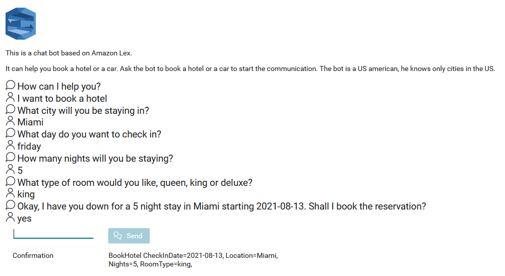
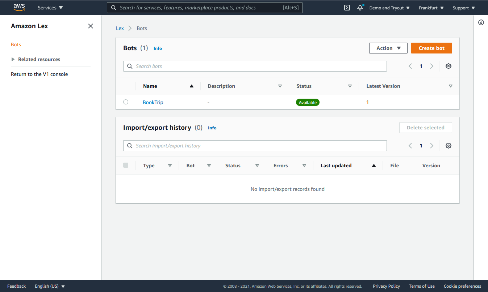

Der [Amazon Lex API]-Konnektor von Axon Ivy integriert Amazon Lex, einen Dienst
zum Erstellen von Konversationsschnittstellen, in Ihre
Prozessautomatisierungs-Workflows. Durch diese Integration können Sie die von
Amazon Lex bereitgestellten Funktionen für natürliche Sprachverarbeitung (NLP)
und maschinelles Lernen (ML) in Ihren Axon Ivy-Prozessen nutzen.

Wichtigste Funktionen des Amazon Lex API-Konnektors:

- **** en zur Absichtserkennung: Die Absichtserkennung ist eine Technik der
  natürlichen Sprachverarbeitung (Natural Language Processing, NLP), mit der das
  Ziel oder der Zweck hinter der Eingabe eines Benutzers identifiziert wird.
- **** für bidirektionale Kommunikation: Die API bietet Methoden zum Senden von
  Nachrichten von Ihrem Prozess an den Bot und zum Empfangen von Antworten,
  wodurch eine nahtlose Kommunikation zwischen Ihrem Prozess und der
  Konversationsschnittstelle ermöglicht wird.
- **Demo-Implementierung**: Axon Ivy bietet eine gebrauchsfertige
  Demo-Implementierung, die Sie ganz einfach an Ihren spezifischen
  Anwendungsfall anpassen können. Dies reduziert Ihren Integrationsaufwand und
  hilft Ihnen, Amazon Lex schnell in Ihre Prozesse zu integrieren.
- **Freemium-Preismodell**: Der Konnektor basiert auf dem Freemium-Preismodell
  von Amazon Web Services (AWS), was bedeutet, dass Sie den Dienst bis zu einer
  bestimmten Nutzungsgrenze kostenlos nutzen können. So können Sie die Vorteile
  von Konversationsschnittstellen in Ihren Prozessen ohne Vorabkosten testen und
  bewerten.

Es ist wichtig zu beachten, dass sowohl Amazon Lex als auch ChatGPT zwar NLP-
und ML-Techniken verwenden, aber unterschiedlichen Zwecken dienen. ChatGPT ist
ein großes Sprachmodell, das von OpenAI trainiert wurde, um offene Gespräche zu
führen und bei verschiedenen Aufgaben zu helfen. Amazon Lex hingegen ist ein
Dienst, der speziell für die Erstellung von Konversationsschnittstellen
(Chatbots) mit vordefinierten Absichten und Aktionen entwickelt wurde.

**Mit dem Amazon Lex API-Konnektor von Axon Ivy können Sie Ihre
Prozessautomatisierungsinitiativen durch die Einführung von
Konversationsfunktionen verbessern und Ihre Prozesse durch natürliche
Sprachinteraktionen benutzerfreundlicher und zugänglicher machen.**

## Demo

### Chatbot

Die Chatbot-Demo basiert auf dem Amazon BookTrip-Demo-Bot.
1. Typ einen beliebigen Buchungstext in das Textfeld ein, z. B.: _Ich möchte ein
   Hotel buchen_ oder _Ich möchte ein Auto buchen_.
2. Beantworten Sie die Fragen der Bots.
3. Amazon Lex erkennt Ihre Absicht und liefert zusätzliche Informationen in der
   Bestätigung.



## Einrichtung

1. Zunächst müssen Sie einen Amazon Lex-Bot erstellen. Gehen Sie dazu auf
   https://aws.amazon.com.

2. Melden Sie sich an oder erstellen Sie ein neues Konto.

3. Klicken Sie auf „Services“ / „Amazon Lex“.

4. Klicken Sie auf „Getting Started Guide“ und folgen Sie den Anweisungen, um
   einen neuen Bot zu erstellen. Stellen Sie sicher, dass Sie einen V2-Bot
   erstellen. Verwenden Sie die Vorlage „BookTrip“.



5. Konfigurieren Sie die folgenden Variablen in Ihrem Projekt:

```
Variables:

  Amazon.Lex:

    # Secret key to access amazon lex
    # [password] 
    SecretKey: <YOUR_SECRET_KEY>

    # Access key to access amazon lex
    # [password]
    AccessKey: <YOUR_ACCESS_KEY>

    # Identifier of the amazon lex bot alias that should be called
    BotAliasId: <YOUR_BOT_ALIAS_ID>

    # Identifier of the amazon lex bot that should be called
    BotId: <YOUR_BOT_ID>
```
